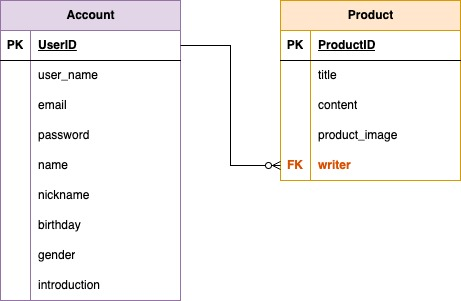

<h3>spartamarket_DRF</h3>

***

<h3>프로젝트 소개</h3>
Django DRF 장고 심화 개인 과제 프로젝트

*** 
<h3>초기 ERD 작성</h3>

***

<h3>기능 소개</h3>
 

`회원가입`   
필수기입 : username, 비밀번호, 이메일, 이름, 닉네임, 생일   
선택기입 : 성별, 자기소개   
username, 이메일 중복 불가   
   
`로그인`   
입력 : username, 비밀번호   
로그인 시 토큰 발급   

`프로필 조회`   
로그인 상태로 로그인 한 본인 계정 프로필 정보 확인 가능   
   
`상품(물건) 등록`   
필수기입 : 판매자, 제목, 내용   
선택기입 : 이미지   
로그인 상태로 게시글 작성 가능   
   
`상품(물건) 목록 조회`   
모든 상품 조회   
1개 페이지에 10개 상품이 표시   
   
`상품(물건) 수정`   
작성자만 수정 가능   
   
`상품(물건) 삭제`   
작성자만 삭제 가능   

***

<h3>API 문서</h3> 

https://documenter.getpostman.com/view/38012126/2sAXjSzUS6
